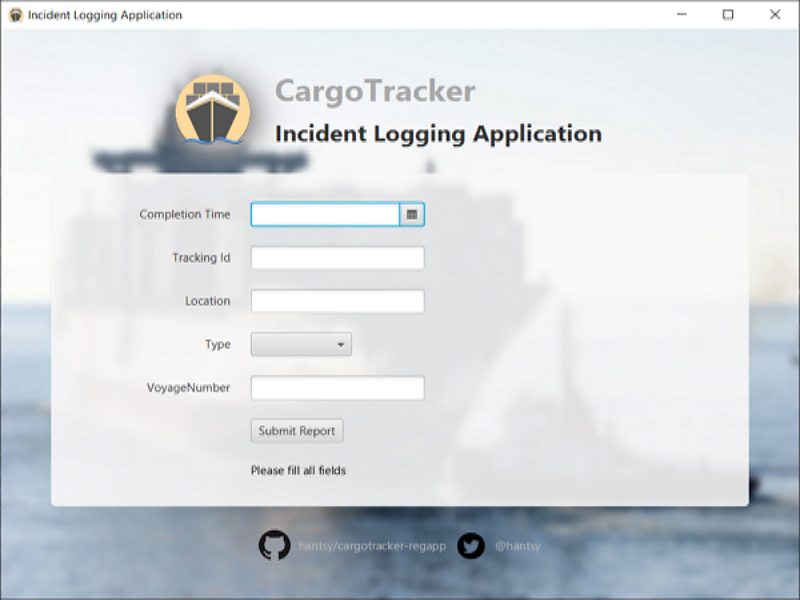

# CargoTracker RegApp

[The original DDD sample regapp](https://github.com/citerus/dddsample-regapp) is written in Swing and Spring. 

This app is used for submitting handling events to the [cargotracker core system](https://github.com/hantsy/cargotracker) (forked from [eclipse-ee4j/cargotracker](https://github.com/eclipse-ee4j//cargotracker)).

* Rebuilding the whole UI with JavaFX 
* Using CDI(JBoss Weld) as IOC container
* The communication between client and server is switched to Jakarta Restful Service(JAX-RS)



## Prerequisites

This project is developed against the latest Java and JavaFX.

* Java 15+
* Apache Maven 3.6.x

## Build 

Clone the source codes from Github, open a terminal and switch to the root folder of the project. 

Execute the following command to build and run the application.

```bash
mvn clean compile exec:java
```

## References

* [JavaFX and CDI: How to Inject many Stages](https://stackoverflow.com/questions/47591527/javafx-and-cdi-how-to-inject-many-stages)
* [Bootstrap Javafx 2.0 with Weld](https://stackoverflow.com/questions/14654627/bootstrap-javafx-2-0-with-weld)
* [JavaFX FXML controller - constructor vs initialize method](https://stackoverflow.com/questions/34785417/javafx-fxml-controller-constructor-vs-initialize-method)
* [cathive/fx-guice](https://github.com/cathive/fx-guice)
* [Introducing FxWeaver - Dependency Injection Support for JavaFX and FXML](https://rgielen.net/posts/2019/introducing-fxweaver-dependency-injection-support-for-javafx-and-fxml/) and  [rgielen /  javafx-weaver](https://github.com/rgielen/javafx-weaver)
* [Getting Started with JavaFX](https://docs.oracle.com/javafx/2/get_started/jfxpub-get_started.htm)
* [Working With Layouts in JavaFX](https://docs.oracle.com/javafx/2/layout/jfxpub-layout.htm)
* [JavaFX Tutorial: FXML and SceneBuilder](https://www.vojtechruzicka.com/javafx-fxml-scene-builder/)
* [TestFX/TestFX](https://github.com/TestFX/TestFX)
* [Test Driven Development In JavaFX With TestFX](https://medium.com/information-and-technology/test-driven-development-in-javafx-with-testfx-66a84cd561e0)
* [trishagee/jb-stock-client](https://github.com/trishagee/jb-stock-client)
* [Spring Tips: JavaFX ](https://spring.io/blog/2019/01/16/spring-tips-javafx)
* [Testing CDI Beans and the Persistence Layer Under Java SE](https://in.relation.to/2019/01/23/testing-cdi-beans-and-persistence-layer-under-java-se/)
* [Weld JUnit 5 Extensions](https://github.com/weld/weld-junit/blob/master/junit5/README.md)
* [sshahine/JFoenix](https://github.com/sshahine/JFoenix)
